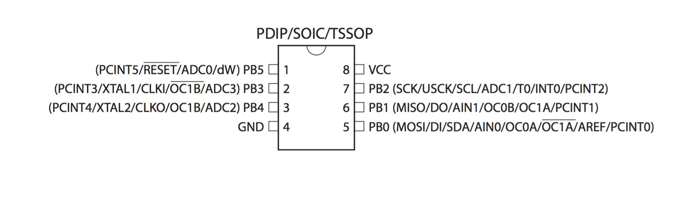
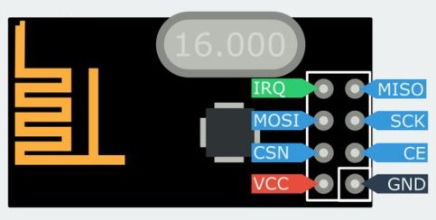

This scheme works for sending data from an Attiny85 to another Arduino. It shows
how to program an Attiny85 with an Arduino Nano, but any other Arduino could be used
for that as an ISP.

There are codes for testing if your setup is correctly connected inside the *test_code*
folder.

This Attiny85 to NRF24L01 setup leaves you with one pin free  to use as you need,
instead of no pin.

Enjoy it :)

### Attiny85 programming

 **Must:** &gt;1 uF  (usually 10uF) VCC (5V)—&gt;RESET (Arduino Nano)

  | Attiny85        | Arduino (Nano) |
  | --------------- | :------------: |
  | 1 (RESET, PB5)  | D10 (SS)       |
  | 2 (PB3)         | NC             |
  | 3 (PB4)         | NC             |
  | 4 (GND)         | GND            |
  | 5 (MOSI, PB0)   | 5 (MOSI)       |
  | 6 (MIS0, PB1)   | D12 (MISO)     |
  | 7 (SCK, PB2)    | D13 (SCK)      |
  | 8 (VCC)         | 5V/3V3         |

### NRF24L01 to Arduino (Nano and Attiny85) connections

**Suggested:**  Capacitor VCC—&gt; GND

 | NRF24L01   | Arduino (Nano) | Attiny85          |
 | ---------- | -------------: | :---------------: |
 | VCC        | 3V3            | VCC (3V3)         |
 | GND        | GND            | GND               |
 | CSN        | 7              | 3 (PB4)           |
 | CE         | 8              | 1 (RESET, PB5)\*  |
 | MOSI       | D11 (MOSI)     | 6 (MIS0, PB1)\*\* |
 | SCK        | D13 (SCK)      | 7 (SCK, PB2)      |
 | IRQ        | NC             | NC                |
 | MISO       | D12 (MISO)     | 5 (MOSI, PB0)\*\* |

\*1 (RESET, PB5) —&gt; VCC.

\*\* Yeah, that is right. Probably something with the library.

### Library

The library  that was used here (and its documentation) can be found at [http://tmrh20.github.io/RF24/](http://tmrh20.github.io/RF24/). 
